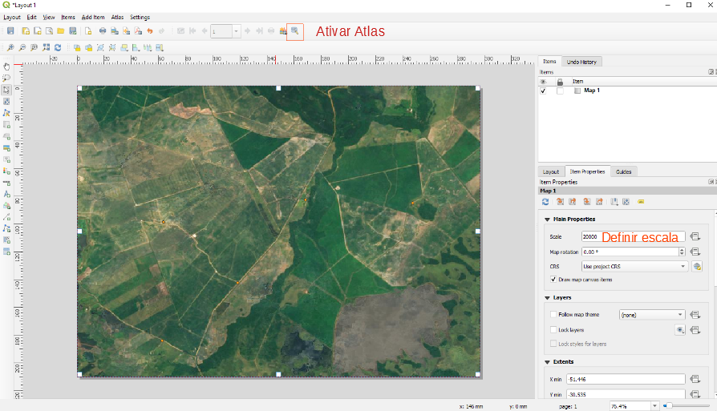
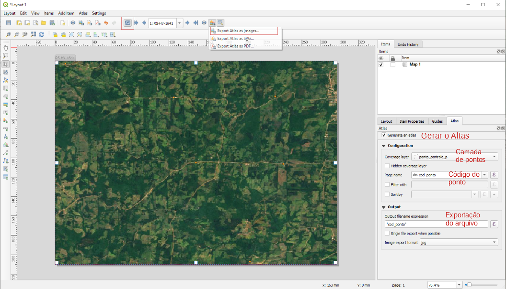

# Conjunto de ferramentas para medição 2
Conjunto de ferramentas automatizam o processo de processamento e controle de qualidade da medição de pontos de controle.
Essas ferramentas complementam as rotinas disponíveis em https://github.com/1cgeo/ferramentas_pto_controle, que devem ser utilizadas em conjunto!
Rotinas disponíveis neste repositório:
* 5- Gerar PPP
* 7- Atualizar banco com dados do PPP
* 8- Gerar Monografia

## Instalação
Certifique-se de ter instalado no seu computador as últimas versões do [NodeJS](https://nodejs.org/en/download/) e do [Python 3.X](https://www.python.org/downloads/)
São utilizadas as dependências [PyPDF2](https://github.com/mstamy2/PyPDF2), [TestCafé](https://github.com/DevExpress/testcafe) e [Secretary](https://github.com/christopher-ramirez/secretary)
Para instalar as dependências necessárias utilize os seguintes comandos:
```
npm install -g testcafe@0.17.2
pip install -r requirements.txt
```

### 5- Gerar PPP
Esta rotina acessa o portal do IBGE e realiza o download do processamento realizado pela plataforma de PPP do IBGE.
Os parâmetros necessários para essa rotina são:
* Navegador a ser utilizado (chrome ou firefox)
* Pasta com a estrutura de pontos de controle
* Pasta na qual será realizada o download do PPP
* Email
```
testcafe -c 3 chrome upload_ppp.js D:\2018-04-06 D:\downloads\ppp test@email.com.br
```

### 7- Atualizar banco com dados do PPP
Esta rotina atualiza o banco de dados com os dados do PPP.
Os parâmetros necessários para essa rotina são:
* Parâmetros de conexão do banco:
    * Host
    * Porta
    * Nome do Banco
    * Usuário
    * Senha
* Pasta com a estrutura de pontos de controle
```
python refreshFromPPP.py D:\2018-04-06 localhost 5432 banco_pt_controle usuario senha
```

### 8- Gerar Monografia
Esta rotina gera monografias baseadas no [Modelo](modelo.odt) em formato ODT.
Para utilizar esta rotina é necessário que o LibreOffice esteja instalado no computador.
Os parâmetros necessários para essa rotina são:
* Pasta com a estrutura de pontos de controle OU Pasta com várias estruturas de pontos de controle
* Parâmetros de conexão do banco:
    * Host
    * Porta
    * Nome do Banco
    * Usuário
    * Senha

**Antes de executar esta rotina, verificar parâmetros adicionais no arquivo [settings.json](generateMono/settings.json)**
No arquivo [settings.json](generateMono/settings.json) serão definidos:
* signature: Caminho da imagem jpeg da assinatura do responsável técnico dos pontos de controle
* photoAerView: Caminho da pasta contendo imagens aéreas dos pontos. O nome da imagem deverá ser o nome do ponto (Ex: RS-HV-01.jpg). Escala recomendada: entre 1:500 e 1:2000
* photoView1: Caminho da pasta contendo imagens aéreas dos pontos. O nome da imagem deverá ser o nome do ponto (Ex: RS-HV-01.jpg). Escala recomendada: entre 1:100000 e 1:250000
* photoView2: Caminho da pasta contendo imagens para localização rápida do ponto em território nacional. O nome da imagem deverá ser o nome do ponto (Ex: RS-HV-01.jpg). Escala recomendada: entre 1:1000000 e 1:2000000
```
python generateMono.py D:\2018-04-06 localhost 5432 banco_pt_controle usuario senha
```

#### Como gerar as vistas aéreas em lote
1- Definir estilos e imagens
2- Gerar o compositor, definir a escala (na aba layout) e habilitar o atlas

3- Configurar o atlas como mostra a imagem abaixo. Não esquecer de habilitar a opção 'Controlado pelo Atlas' na aba Propriedades do item

4- Exportar as imagens na opção 'Exportar Atlas como imagem' 
